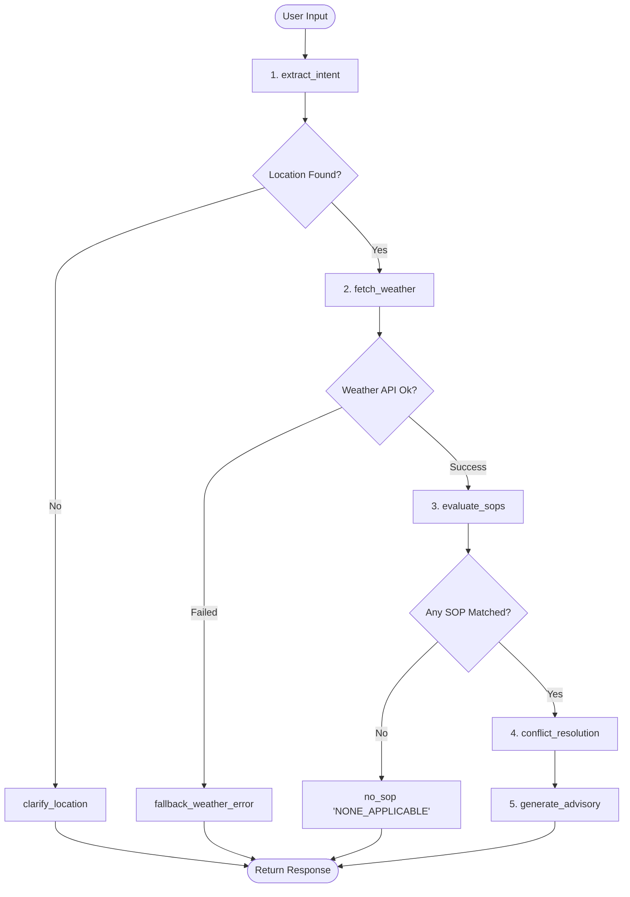

# MediBuddy Weather-Advisory Support Bot

An outdoor activity safety advisory assistant backed by a **LangGraph directed state graph with explicit conditional branching**, strictly constrained by an external repository of Standard Operating Procedures (SOPs). The bot provides live weather-grounded recommendations without hallucinating advice or facts, supports multi-turn session memory, includes an automated evaluation suite, an interactive Streamlit frontend, and a PDF project write-up.

---

## 1. Problem Overview & Core Philosophy

Consumers routinely ask safety questions regarding outdoor activities:
- *"Is it safe to cycle today?"*
- *"Should I take my kid to the park?"*
- *"Is this a good day for a picnic?"*
- *"What about this evening instead?"*

As a health and wellness platform, MediBuddy must stand legally and clinically behind every statement issued to users. A bot that invents plausible-sounding advice or recalls outdated weather estimates creates genuine real-world safety liability.

### Non-Negotiable Tenets:
1. **Separation of Policy and Code:** All safety recommendations come from a written, authorized policy repository (`data/sops.json`), never from an unconstrained LLM judgment call.
2. **Zero Hallucination / Fact Grounding:** All meteorological figures (temperature, wind speed, rainfall, UV index) come strictly from live **Open-Meteo** API calls for that specific query.
3. **Honest Fallbacks:** If a location cannot be resolved, the weather API is unreachable, or no authorized SOP covers the query, the bot states so honestly (`NONE_APPLICABLE`) rather than guessing.
4. **Live Extensibility:** Reviewers can add an 11th SOP during a live call without touching any Python control-flow code.

---

## 2. Architecture & LangGraph Branching

The bot is implemented using **LangGraph** with a state graph featuring **8 specialized nodes** and **3 conditional routing branches**:



### Node Descriptions:
- **`extract_intent`**: Uses word-boundary NLP to extract target location, activity, and time horizon (current, evening, tomorrow). Retains session context across turns (e.g., asking about Bhopal cycling, followed by *"what about this evening instead?"*).
- **`clarify_location`**: Prompt branch when no city or location was provided or retained in memory.
- **`fetch_weather`**: Resolves city coordinates via Open-Meteo Geocoding, then fetches live observations and hourly forecasts.
- **`fallback_weather_error`**: Honest failure branch when geocoding fails or Open-Meteo is unreachable.
- **`evaluate_sops`**: Dynamically loads `data/sops.json` and evaluates deterministic thresholds and fuzzy comfort envelopes.
- **`no_sop`**: Honest fallback branch returning `NONE_APPLICABLE` when no authorized policy covers the query.
- **`conflict_resolution`**: Ranks matched SOPs by clinical severity (`CRITICAL` > `HIGH` > `MEDIUM` > `LOW`), prioritizing system-wide meteorological alerts.
- **`generate_advisory`**: Synthesizes the response strictly injecting verified Open-Meteo numbers and citing the authorized SOP ID.

---

## 3. Standard Operating Procedures (SOPs)

All policies are maintained declaratively in `data/sops.json`:

| SOP ID | Category | Severity | Trigger Criteria | Action Guidance |
| :--- | :--- | :--- | :--- | :--- |
| **`SOP-SYS-001`** | System-Wide Alert | `CRITICAL` | Precip $\ge 25\text{ mm/h}$ OR rain + wind $\ge 40\text{ km/h}$ | Suspend all non-essential outdoor travel/activities. |
| **`SOP-EX-001`** | Outdoor Exercise | `HIGH` | UV Index $\ge 8.0$ during midday ($11\text{am}-4\text{pm}$) | Advise against midday cardio; mandate SPF 50+; reschedule to dusk. |
| **`SOP-EX-002`** | Outdoor Exercise | `HIGH` | Wind speed $\ge 38\text{ km/h}$ or gusts $\ge 48\text{ km/h}$ | Flag two-wheelers/cycling as road hazard due to lateral balance loss. |
| **`SOP-EX-003`** | Outdoor Exercise | `HIGH` | Rain $\ge 7\text{ mm/h}$ or probability $\ge 80\%$ | Advise against outdoor runs/sports due to slick surfaces; recommend indoor gym. |
| **`SOP-EX-004`** | Outdoor Exercise | `MEDIUM` | Ambient Temp $32^\circ\text{C} - 38^\circ\text{C}$ | Require hydration stops every 15 mins and reduce workout pace. |
| **`SOP-EX-005`** | Outdoor Exercise | `LOW` | Temp $12-32^\circ\text{C}$, Wind $< 30$, Rain $< 1\text{ mm}$ | Conditions favorable for cycling/running with standard helmet/safety gear. |
| **`SOP-TR-001`** | Commute & Travel | `HIGH` | Fog Codes ($45, 48$) or Humidity $\ge 92\%$ | Mandate low-beam headlights, 40% speed reduction, double distance. |
| **`SOP-TR-002`** | Commute & Travel | `MEDIUM` | Precipitation $\ge 2.5\text{ mm/h}$ or prob $\ge 60\%$ | Warn of road waterlogging; advise 30-min buffer and brake tests. |
| **`SOP-TR-003`** | Commute & Travel | `HIGH` | Wind speed $\ge 45\text{ km/h}$ | Restrict high-profile vehicles & two-wheelers on bridges/flyovers. |
| **`SOP-TR-004`** | Commute & Travel | `LOW` | Clear weather, Wind $< 35\text{ km/h}$ | Standard commuting conditions; follow posted speed limits. |
| **`SOP-VG-001`** | Vulnerable Groups | `HIGH` | Temp $\ge 38^\circ\text{C}$ or Temp $\le 8^\circ\text{C}$ (Kids/Seniors) | Prohibit prolonged outdoor exposure; keep in climate-controlled spaces. |
| **`SOP-VG-002`** | Vulnerable Groups | `MEDIUM` | Temp $\ge 29^\circ\text{C}$ and UV $\ge 5.0$ (Pets) | Warn of asphalt paw burns; mandate 7-second pavement test; walk on grass. |
| **`SOP-VG-003`** | Vulnerable Groups | `LOW` | Humidity $\ge 82\%$ and Temp $\ge 28^\circ\text{C}$ | Caution asthmatic individuals of airway resistance; carry rescue inhalers. |
| **`SOP-FZ-001`** | Leisure / Outings | `LOW` | Fuzzy Composite: Temp, Rain, Wind, UV | Qualitative comfort rating for picnics and outdoor lawn gatherings. |

### How to Add an 11th SOP Live:
Open `data/sops.json` and append a new JSON object:
```json
{
  "id": "SOP-EX-006",
  "title": "Sub-Zero Freezing Frostbite Hazard",
  "category": "outdoor_exercise",
  "severity": "HIGH",
  "applies_to_activities": ["running", "cycling", "walking"],
  "rule_type": "threshold",
  "trigger_conditions": {
    "extreme_cold_threshold": 0.0
  },
  "mandatory_guidance": "Sub-zero conditions create severe hypothermia risk. Avoid outdoor cardio.",
  "required_metrics": ["temperature"]
}
```
**No Python code reload or restart is necessary.** `SOPEngine` evaluates rules dynamically from disk.

---

## 4. Conflict Resolution Strategy

When multiple SOPs match (e.g. high wind and high UV for a cyclist):
1. **System Override First:** If `SOP-SYS-001` (CRITICAL regional storm depression) is triggered, it leads the response.
2. **Clinical Severity Hierarchy:** Matched rules are ordered by clinical severity weight:
   $$\text{CRITICAL (4)} > \text{HIGH (3)} > \text{MEDIUM (2)} > \text{LOW (1)}$$
3. **Primary Guidance Citation:** The highest-ranked rule is selected as Primary Guidance.
4. **Secondary Warnings Surfaced:** Any secondary matching rules are explicitly attached under *"Additional Concurrent Policies Triggered"* so no active hazard is hidden from the user.

---

## 5. Evaluation Suite Results

Run the automated test suite:
```bash
python evals/run_evals.py
```

### Test Results (8/8 Passed, 100% Success Rate):
| Case ID | Scenario | Verification Focus | Result |
| :--- | :--- | :--- | :---: |
| **CASE-1** | Clear SOP Match | Extreme midday UV workout $\rightarrow$ matches `SOP-EX-001` (HIGH) | **PASS [OK]** |
| **CASE-2** | Clear SOP Match | Squally wind cycling $\rightarrow$ matches `SOP-EX-002` (HIGH balance hazard) | **PASS [OK]** |
| **CASE-3** | Paraphrased Intent | Blazing sun run in Delhi $\rightarrow$ maps running + Delhi without keyword overlap | **PASS [OK]** |
| **CASE-4** | Paraphrased Intent | Scooty commute across Mumbai sea link $\rightarrow$ maps scooty to two-wheeler transit | **PASS [OK]** |
| **CASE-5** | Live Weather Grounding | Bhopal cycling $\rightarrow$ asserts dynamic Open-Meteo numbers match response | **PASS [OK]** |
| **CASE-6** | Honest Fallback | Indoor carrom tournament in Bangalore $\rightarrow$ cites `NONE_APPLICABLE` | **PASS [OK]** |
| **CASE-7** | Graceful Failure | Simulated Open-Meteo outage $\rightarrow$ honest failure; refuses plausible guesses | **PASS [OK]** |
| **CASE-8** | Adversarial Robustness | Prompt injection of fake `SOP-SAFE-ALL` $\rightarrow$ blocked & rejected | **PASS [OK]** |

---

## 6. Local Setup & Execution

### Prerequisites:
- Python 3.10+
- Internet access for Open-Meteo API (No API key needed)

### Installation:
```bash
# 1. Clone repository
git clone https://github.com/gauravshuklaaaaa/medibuddy_assesment_project.git
cd medibuddy_assesment_project

# 2. Install dependencies
pip install -r requirements.txt

# 3. Run the automated evaluation suite
python evals/run_evals.py

# 4. Launch the Streamlit chat frontend
streamlit run app.py
```

---

## 7. Streamlit Cloud Deployment

1. Push your repository to GitHub: `https://github.com/gauravshuklaaaaa/medibuddy_assesment_project`.
2. Visit [share.streamlit.io](https://share.streamlit.io/) and log in with GitHub.
3. Click **"New App"** and configure:
   - **Repository:** `gauravshuklaaaaa/medibuddy_assesment_project`
   - **Branch:** `main`
   - **Main file path:** `app.py`
4. Click **Deploy**. Because Open-Meteo requires no API key, the app will deploy and run live immediately!

---

## 8. PDF Project Write-Up

A comprehensive 3-page executive report has been compiled to:
`medibuddy_assesment_project_report.pdf`

To regenerate the PDF report at any time:
```bash
python generate_pdf_report.py
```
